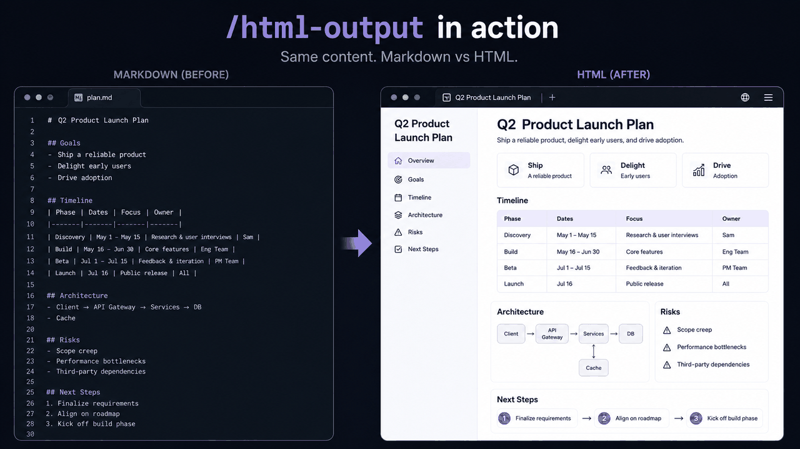

# html-output

<p align="center">
  
</p>

Markdown caps out at ~100 lines of readability. HTML scales further — tables, SVG diagrams, code, interactivity, share as a link. This skill makes that swap a one-liner (`/html-output`). Operational spec: [SKILL.md](SKILL.md).

**Inspired by:**

- **Andrej Karpathy** — [*"ask your LLM to 'structure your response as HTML', then view the generated file in your browser"*](https://x.com/karpathy/status/2053872850101285137). Frames the progression: raw text → markdown → **HTML** → … → interactive neural simulations.
- **Thariq Shihipar** — [*"Using Claude Code: The Unreasonable Effectiveness of HTML"*](https://x.com/trq212/status/2052809885763747935) (also on the Claude Blog · [gallery of HTML examples](https://thariqs.github.io/html-effectiveness/)). The thesis post: information density, visual clarity, shareability, two-way interaction. Thariq actually cautions *against* turning the pattern into a `/html` skill — this one is a sharable preset on top of the prompting habit, not a substitute.

## Install

Just this skill (run from the repo root):

```bash
ln -s "$PWD/skills/html-output" ~/.claude/skills/html-output
```

Or install every skill + agent in this repo in one line — see the [top-level Install section](../../README.md#install). Claude Code only loads `SKILL.md` from a skill folder, so this `README.md` is human-facing only; safe to leave alongside `SKILL.md`, or delete after install if you want a lean `~/.claude/skills/html-output/` tree.

## Use

**With Claude Code:**

```text
/html-output                    # convert the most recent plan file
/html-output path/to/file.md    # convert a specific file
```

Or just ask in natural language: *"make this an HTML page"*, *"structure your response as HTML"*, *"turn this into a slide deck"*. Output lands as a sibling `.html` file next to the source.

**With any other agentic system** (OpenAI Codex, Cursor agent mode, Cline, Aider, Devin, custom agents built on the Anthropic / OpenAI / Vercel AI SDKs):

Copy the body of [SKILL.md](SKILL.md) into the agent's system prompt (or paste at the top of a new conversation). The trigger phrases become invocation patterns; the agent reads them and applies the same design pass. Only Claude-Code-specific bits are the `Edit` / `Write` / `Monitor` tool names — substitute your agent's equivalent file-write capability.

> [!NOTE]
> Chat UIs (ChatGPT, Claude.ai web, Gemini web) are out of scope here — they can read the workflow but can't write the output `.html` file. Use the natural-language triggers in those, but expect to copy the HTML back manually.

Full operational spec: [SKILL.md](SKILL.md).
